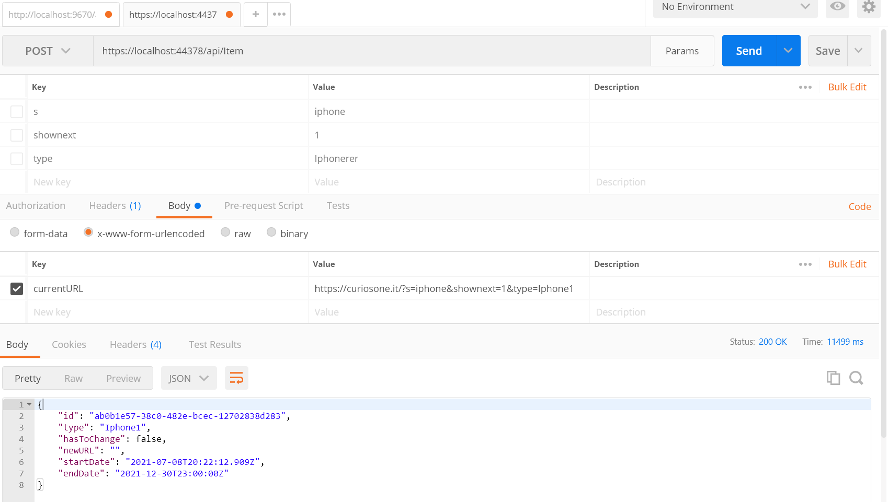

# Item Rest Service API Using .NET Core
-----------
Author : Waleed Alromaema
         wal.roma@outlook.it
-----------
###Content:

1- About The API.

2- Item Database Design

	   a- Database Design
	   b- Business Logic Design
	   c- Rest API Interface
   
3- Runing Application

----------------
## 1- About Items API.

Item API is Microservice REST API Application developed by .NET Core API . It provide the following Services:

- Get :
     - All Items in Mongo DB
- Post :
     - Send Parameter of URL 
     - Post Function Parse URL and Get Type.
     - then It Quary Database for Item by Type.
     - Return the result. 


## 2- Item Database Design

### A- Database Design

the Database consists of only one Collection Items.
   
### B- Business Logic Design

The design pattern considered the separation between different layers,  
- Presentation layer [her is the REST API Service Provider] 
     - using Rest Controllers.
     
- Business Logic Layer
     - using Domain Objects as Item Class.
     - Service Interface and Implementation for all Item Services needed.
     
- Repository Data Access Layer 
     - I implemented MongoCRUD for all needed DB operation on Item
 
       
### C-Rest API Interface
 
 below are the set of REST Services and the associated URI.
 
    

## 3- Setting and Running Application
#### - Database Configuration
-  The Class MongoDBConfiguration is used for Automatic binding the MongoDB Connection Parameters from either 
    Docker Environment variable if not exist it get information from database related information stored in appsetting
- in this way we guranteed that we get info from first priority is Docker Environmental Variables then if not exist from the appsetting :   

```
   public class MongoDBConfiguration
    {
        public string Database { get; set; }
        public string Host { get; set; }
        public int Port { get; set; }
        public string User { get; set; }
        public string Password { get; set; }
        public string ConnectionString
        {
            get
            {
                string UserEnvVar = Environment.GetEnvironmentVariable("MONGO_INITDB_ROOT_USERNAME");
                string PasswordEnvVar = Environment.GetEnvironmentVariable("MONGO_INITDB_ROOT_PASSWORD");
                if (string.IsNullOrEmpty(UserEnvVar) || string.IsNullOrEmpty(PasswordEnvVar))
                {

                    if (string.IsNullOrEmpty(User) || string.IsNullOrEmpty(Password))
                    {
                        return $@"mongodb://{Host}:{Port}";
                    }
                    else 
                        return $@"mongodb://{User}:{Password}@{Host}:{Port}";
                }
                else
                {
                    return $@"mongodb://{UserEnvVar}:{PasswordEnvVar}@{Host}:{Port}";
                }
                    
                
            }
        }
    }
```
   
   or Docker Database information stored in an Environmental variable stored with in the Docker-Composs.yml file:
   
```
    itemsapi_v1:
    image: ${DOCKER_REGISTRY-}itemsapiv1
    build:
      context: .
      dockerfile: ItemsAPI_V1\Dockerfile
    ports:
      - 5000:80
    environment:
      MongoDB__Host: mongo
      MONGO_INITDB_ROOT_USERNAME: root
      MONGO_INITDB_ROOT_PASSWORD: root
    depends_on:
      - mongo 
```

- In Startup file we bind the configuration from appsetting to the instance of ServerConfiguration class object that used to map appsetting MongoDB Json entray 
- ServerConfiguration class consist of :

```
 public class ServerConfiguration
    {
        public MongoDBConfiguration MongoDB { get; set; } = new MongoDBConfiguration();
    }
```

  with ServerConfiguration class using :

```
            ServerConfiguration configuration = new ServerConfiguration();
            Configuration.Bind(configuration);
```

	    
### The tools required are: 
-  visual Studio 2019
-  use nuget to get Mongo db drivers
-  POSTMAN Chrome application for client test of rest service in server side download from https://go.pstmn.io/ 


#### - Git Link

```
https://github.com/WaleedAlromaema/ItemsAPI_V1.git
```

#### - POSTMAN

using postman for testing the Rest api service
Enter in URL: LOCALHOST:44378/api/...
as in the rest api listed above:

###here is an example of GET Item result:


### Example of Item Post :




